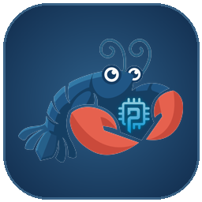

  
  &nbsp;&nbsp;&nbsp;
  

<h1 align="center">AI Add-ons for Home Assistant</h1>

  

  Pre-built AI agent add-ons for Home Assistant — no compilation, no waiting, no build failures. 
  Supports Raspberry Pi (aarch64) and standard x86_64 machines.

---

## Add-ons

| | [ZeroClaw](zeroclaw/) | [PicoClaw](picoclaw/) |
| --- | --- | --- |
| **Based on** | [ZeroClaw Labs](https://www.zeroclawlabs.ai) | [Sipeed PicoClaw](https://picoclaw.io) |
| **Language** | Rust | Go |
| **RAM** | ~100MB | < 10MB |
| **Web UI** | Port 42617 (built-in dashboard) | Port 18800 (launcher) |
| **Web terminal** | ✓ (ttyd) | — |
| **Telegram** | ✓ (via HA options) | ✓ (via web UI) |
| **Home Assistant MCP** | ✓ | ✓ |
| **Channels** | Telegram | Telegram, Discord, Matrix, Slack, IRC, and more |
| **Best for** | Full-featured daemon with persistent memory | Ultra-lightweight, multi-channel, low-power devices |

---

## Installation

### One-click

### Manual

1. In Home Assistant go to **Settings → Add-ons → Add-on Store**
2. Click **⋮ → Repositories** and add: `https://github.com/tonyputi/hassio-addons`
3. Find **ZeroClaw** or **PicoClaw** in the store and install

---

## ZeroClaw

  
  &nbsp;
  
  &nbsp;
  

A full-featured AI daemon with persistent memory, workspace files, cron scheduling, web dashboard, and web terminal. Configure everything from the HA UI — provider, model, Telegram, and Home Assistant MCP.

**Quick start:** Set `provider`, `api_key`, `model`, and `timezone` in the add-on options, then start. The web dashboard is at `http://<ha-ip>:42617`.

→ [ZeroClaw documentation](zeroclaw/DOCS.md) · [Changelog](zeroclaw/CHANGELOG.md) · [zeroclawlabs.ai](https://www.zeroclawlabs.ai)

---

## PicoClaw

  
  &nbsp;
  
  &nbsp;
  
  &nbsp;
  

An ultra-lightweight AI agent written in Go. Boots in under a second, uses less than 10MB of RAM. Configure providers, models, and channels through the browser-based launcher UI at port 18800.

**Quick start:** Set `timezone` in the add-on options, start, then open `http://<ha-ip>:18800` to complete setup.

→ [PicoClaw documentation](picoclaw/DOCS.md) · [picoclaw.io](https://picoclaw.io)

---

## Support

- Issues with these add-ons: [open an issue](https://github.com/tonyputi/hassio-addons/issues)
- ZeroClaw: [zeroclawlabs.ai](https://www.zeroclawlabs.ai)
- PicoClaw: [picoclaw.io](https://picoclaw.io)
